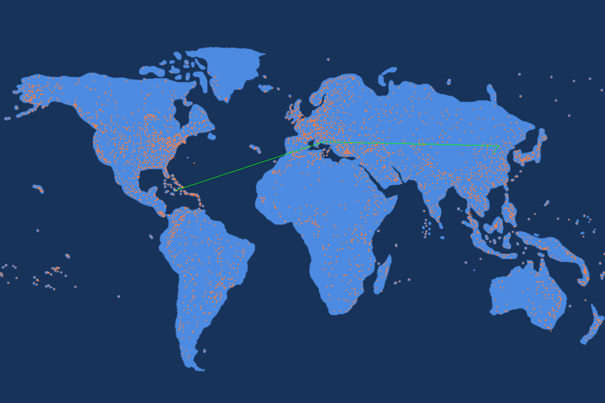
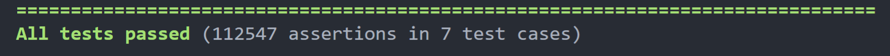

# OpenFlights Shortest Path Visualization

This project explores the directed graph data structure and specifically how it can be applied to finding the shortest path between two airports. We allow the user to input certain parameters, such as the starting and ending airport location, to create a visual representation of all the different airports and the shortest path between airports

## Getting Started

To get this project running on your machine, follow the steps below

### Prerequisites and Installation

We recommend you run this device on the University's EWS system. For instructions on how to set this up, follow the instructions [here](https://courses.engr.illinois.edu/cs225/fa2020/resources/own-machine/)

You will also need the required version of Clang to compile our program with the Makefile. Once you're on EWS, you can load the correct version of Clang with the command below

```
module load llvm/6.0.1
```

Once everything is set up, you can clone this repository by running the following command in your preferred editor/terminal

```
git clone https://github-dev.cs.illinois.edu/cs225-fa20/balepur2-tejasrs2-aotingc2-yizhenl3.git
```

### Running the Project

To run the project, first ensure the code is compiled properly with the following command

```
make finalproj
```

You can then run the visualization with the command below

```
./finalproj [Airport Data Location] [Route Data Location] [Source Airport] [Destination Airport] [Image Location] [GIF Location]
```

* `Airport Data Location` : The file location of the airports dataset. Our data can be found at `data/airports.dat`
* `Route Data Location` : The file location of the routes dataset. Our data can be found at `data/routes.dat`
* `Source Airport` : The OpenFlights unique identifier for the starting airport
* `Destination Airport` : The OpenFlights unqiue identifier for the ending airport
* `Image Location` : The desired output location for the PNG file (must end in .png)
* `GIF Location` : The desired output location for the GIF file (must end in .gif)

After running the command above, you will see messages in the console alerting you if your inputs were invalid, or directing you to the output of the program

## Project Demo

Below we have two demos: one for our visualization program and one for our test cases

### Visualization Program Demo

For this demo we will be running the following command

```
./finalproj data/airports.dat data/routes.dat 1905 6343 out.png out.gif
```

After running this command, there will be two files found in the `results` folder, `out.png` and `out.gif`

Image representation of the shortest path:



Animated representation of the shortest path:


### Tests Demo

We have also created test cases to validate our results, specifically supporting the following:

* Distance Conversion
* Data Parsing
* Breadth-First Search
* Dijkstra's Algorithm

You can run our automated test cases with the following commands

```
make test
./test
```

After running our test cases, you should see the following output



## Authors

* **Nishant Balepur**
* **Tejas Satpalkar**
* **Yizhen Lu**
* **Bella Chen**

## Acknowledgments

* This project was created as a final project for [CS225](https://courses.engr.illinois.edu/cs225/fa2020/)
* Our flight data was taken from [OpenFlights](https://openflights.org/data.html)
